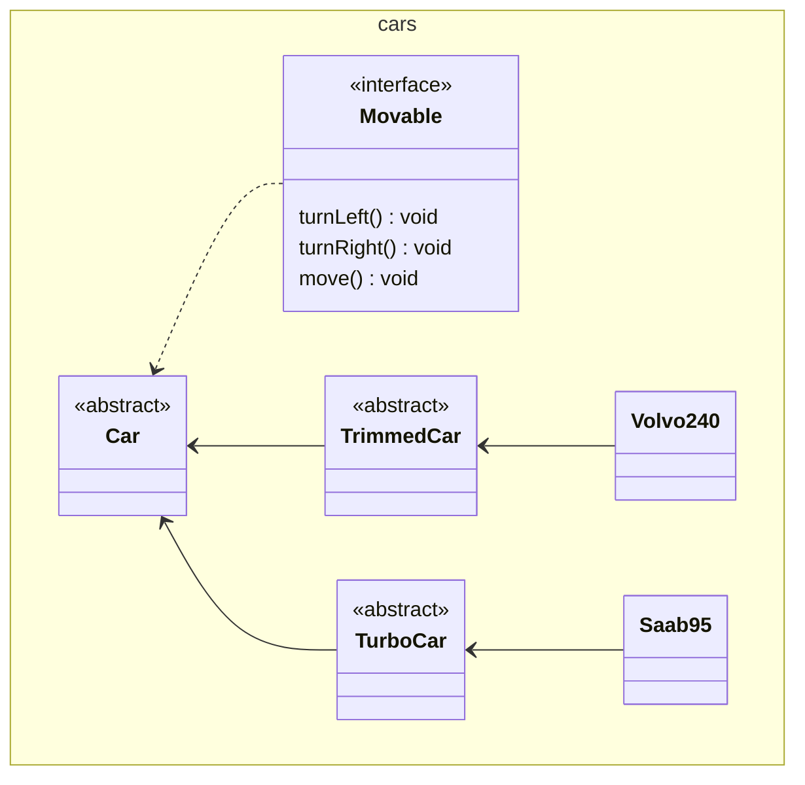

```mermaid
classDiagram
  namespace cars {
    class Movable{
      turnLeft() void
      turnRight() void
      move() void
    }

    class Car {
    }

    class TrimmedCar {
    }

    class TurboCar {
    }

    class Volvo240 {
    }

    class Saab95 {
    }
  }
  <<abstract>> Car
  <<abstract>> TrimmedCar
  <<abstract>> TurboCar
  <<interface>> Movable
  Car <.. Movable
  Car <-- TrimmedCar
  Car <-- TurboCar
  TrimmedCar <-- Volvo240
  TurboCar <-- Saab95
```