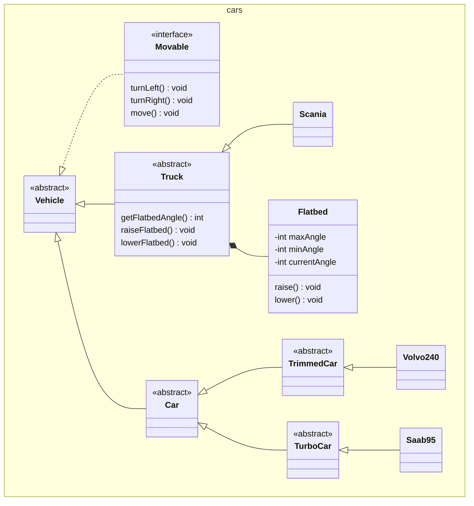

```mermaid
classDiagram
  namespace cars {
    class Movable{
      turnLeft() void
      turnRight() void
      move() void
    }

    class Vehicle {
    }

    class Truck {
      getFlatbedAngle() int
      raiseFlatbed() void
      lowerFlatbed() void
    }

    class Scania {
    }

    class Flatbed {
      -int maxAngle
      -int minAngle
      -int currentAngle
      raise() void
      lower() void
    }

    class Car {
    }

    class TrimmedCar {
    }

    class TurboCar {
    }

    class Volvo240 {
    }

    class Saab95 {
    }
  }

  <<abstract>> Vehicle
  <<abstract>> Truck
  <<abstract>> Car
  <<abstract>> TrimmedCar
  <<abstract>> TurboCar
  <<interface>> Movable

  Vehicle <|.. Movable
  Vehicle <|-- Car
  Vehicle <|-- Truck
  Truck <|-- Scania
  Truck *-- Flatbed
  Car <|-- TrimmedCar
  Car <|-- TurboCar
  TrimmedCar <|-- Volvo240
  TurboCar <|-- Saab95

```