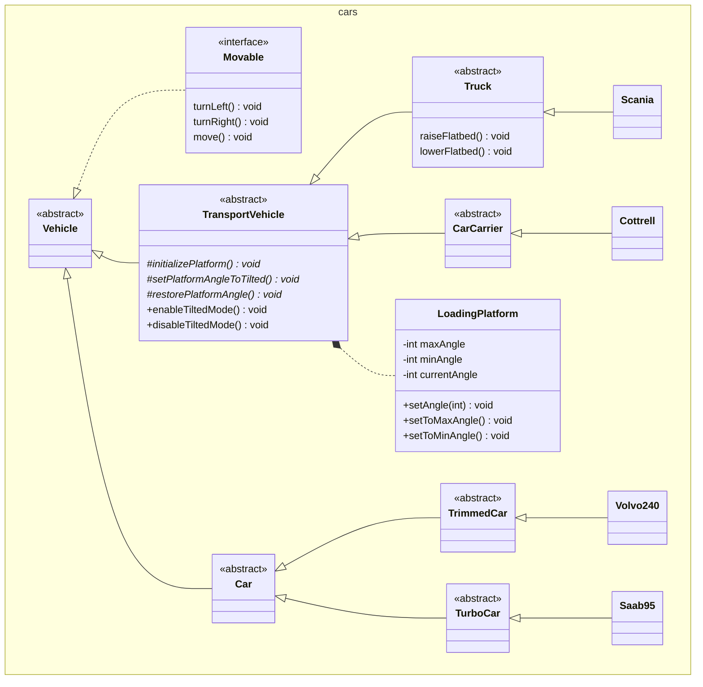

```mermaid

classDiagram

  namespace cars {

    class Movable{
      turnLeft() void
      turnRight() void
      move() void
    }

    class Vehicle {
    }

    class TransportVehicle {
      #initializePlatform() void*
      #setPlatformAngleToTilted() void*
      #restorePlatformAngle() void*
      +enableTiltedMode() void
      +disableTiltedMode() void
    }

    class CarCarrier {
    }

    class Cottrell {
    }

    class Truck {
      
      raiseFlatbed() void
      lowerFlatbed() void
    }

    class Scania {
    }

    class LoadingPlatform {
      -int maxAngle
      -int minAngle
      -int currentAngle
      +setAngle(int) void
      +setToMaxAngle() void
      +setToMinAngle() void
    }

    class Car {
    }

    class TrimmedCar {
    }

    class TurboCar {
    }

    class Volvo240 {
    }

    class Saab95 {
    }
  }

  <<abstract>> Vehicle
  <<abstract>> TransportVehicle
  <<abstract>> CarCarrier
  <<abstract>> Truck
  <<abstract>> Car
  <<abstract>> TrimmedCar
  <<abstract>> TurboCar
  <<interface>> Movable

  Vehicle <|.. Movable
  Vehicle <|-- TransportVehicle
  Vehicle <|-- Car
  TransportVehicle <|-- Truck
  TransportVehicle <|-- CarCarrier
  TransportVehicle *.. LoadingPlatform
  Truck <|-- Scania
  CarCarrier <|-- Cottrell
  Car <|-- TrimmedCar
  Car <|-- TurboCar
  TrimmedCar <|-- Volvo240
  TurboCar <|-- Saab95

```